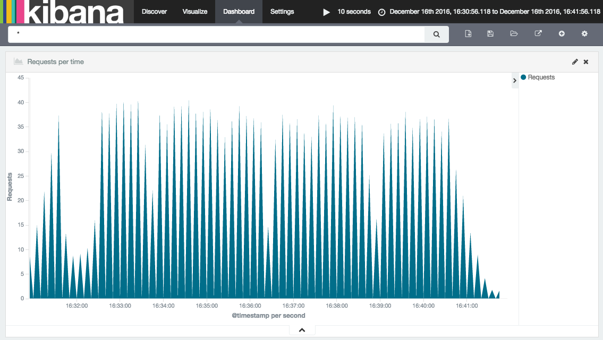

# {{ page.title }}

By this point you should be familiar with the fundamental concepts behind both Apache Brooklyn and YAML blueprints. This section of the documentation is intended to show a complete, advanced example of a YAML blueprint.

The intention is that this example is used to learn the more in-depth concepts, and also to serve as a reference when writing your own blueprints. This page will first explain what the example application is and how to run it, then it will spotlight interesting features.

Please note, there is now a much more up-to-date ELK blueprint that can be found [here](https://github.com/brooklyncentral/brooklyn-elk/). We've using an older version of this in the tutorial as it highlights some key Brooklyn concepts.

### ELK Stack Example

This example demonstrates the deployment of an ELK Stack (Elasticsearch, Logstash and Kibana), using the provided blueprint to deploy, install, run and manage all three. Briefly, the component parts are:

* Elasticsearch: A clustered search engine
* Logstash: Collects, parses and stores logs. For our example it will store logs in Elasticsearch
* Kibana: A web front end to Elasticsearch

We also deploy a simple webserver whose logs will be collected.

* Tomcat 8: Web server whose logs will be stored in Elasticsearch by Logstash.

For more about the ELK stack, please see the documentation [here](https://www.elastic.co/webinars/introduction-elk-stack).

#### The Blueprints
-----------

There are four blueprints that make up this application. Each of them are used to add one or more catalog items to Brooklyn. You can find them below:

* [Elasticsearch](example_yaml/brooklyn-elasticsearch-catalog.bom)
* [Logstash](example_yaml/brooklyn-logstash-catalog.bom)
* [Kibana](example_yaml/brooklyn-kibana-catalog.bom)
* [ELK](example_yaml/brooklyn-elk-catalog.bom)

#### Running the example
First, add all four blueprints to the Brooklyn Catalog. This can be done by clicking the 'Catalog' tab, clicking the '+'
 symbol and pasting the YAML. Once this is done, click the 'Application' tab, then the '+' button to bring up the add 
application wizard. A new Catalog application will be available called 'ELK Stack'. Using the add application wizard, 
you should be able to deploy an ELK stack to a location of your choosing.  Alternatively use the `br` Brooklyn
command line tool and add the files with `br catalog add`.

#### Exploring the example
After the application has been deployed, you can ensure it is working as expected by checking the following:

* There is a Kibana sensor called `main.uri`, the value of which points to the Kibana front end. You can explore this 
front end, and observe the logs stored in Elasticsearch. Many Brooklyn applications have a `main.uri` set to point you 
in the right direction.
* You can also use the Elasticsearch REST API to explore further. The Elasticsearch Cluster entity has a `urls.http.list` 
sensor. Using a host:port from that list you will be able to access the REST API. The following URL will give you the 
state of the cluster `http://<host:port>/_cluster/health?pretty=true`. As you can see the `number_of_nodes` is 
currently 2, indicating that the Elasticsearch nodes are communicating with each other.

### Interesting Feature Spotlight
We will mainly focus on the Elasticsearch blueprint, and will be clear when another blueprint is being discussed. This blueprint describes a cluster of Elasticsearch nodes. 

#### Provisioning Properties
Our Elasticsearch blueprint has a few requirements of the location in which it is run. Firstly, it must be run on an
Ubuntu machine as the example has been written specifically for this OS. Secondly, two ports must opened to ensure
that the entities can be accessed from the outside world. Both of these requirements are configured via 
`provisioning.properties` as follows:

~~~yaml
brooklyn.config:
  elasticsearch.http.port: 9220
  elasticsearch.tcp.port: 9330
  provisioning.properties:
    osFamily: ubuntu
    inboundPorts:
    - $brooklyn:config("elasticsearch.http.port")
    - $brooklyn:config("elasticsearch.tcp.port")
~~~

#### VanillaSoftwareProcess
When composing a YAML blueprint, the VanillaSoftwareProcess is a very useful entity to be aware of. 
A VanillaSoftwareProcess will instruct Brooklyn to provision an instance, and run a series of shell 
commands to setup, run, monitor and teardown your program. The commands are specified as configuration 
on the VanillaSoftwareProcess and there are several available. We will spotlight a few now. To simplify
 this blueprint, we have specified ubuntu only installs so that our commands can be tailored to this 
 system (e.g. use apt-get rather than yum).

##### Customize Command
The Customize Command is run after the application has been installed but before it is run. It is the perfect
 place to create and amend config files. Please refer to the following section of the Elasticsearch blueprint:

~~~yaml
customize.command: |
  sudo rm -fr sudo tee /etc/elasticsearch/elasticsearch.yml
  echo discovery.zen.ping.multicast.enabled: false | sudo tee -a /etc/elasticsearch/elasticsearch.yml
  echo discovery.zen.ping.unicast.enabled: true | sudo tee -a /etc/elasticsearch/elasticsearch.yml
  echo discovery.zen.ping.unicast.hosts: ${URLS_WITH_BRACKETS} | sudo tee -a /etc/elasticsearch/elasticsearch.yml
  echo http.port: ${ES_HTTP_PORT} | sudo tee -a /etc/elasticsearch/elasticsearch.yml
  echo transport.tcp.port: ${ES_TCP_PORT} | sudo tee -a /etc/elasticsearch/elasticsearch.yml
  echo network.host: ${IP_ADDRESS} | sudo tee -a /etc/elasticsearch/elasticsearch.yml
~~~

The purpose of this section is to create a YAML file with all of the required configuration. We use the YAML 
literal style `|` indicator to write a multi line command. We start our series of commands by using the `rm` command to remove the 
previous config file. We then use `echo` and `tee` to create the new config file and insert the config. Part 
of the configuration is a list of all hosts that is set on the parent entity- this is done by using a combination
 of the `component` and  `attributeWhenReady` DSL commands. More on how this is generated later.

##### Check running
After an app is installed and run, this command is scheduled to run regularly and used to populate the `service.isUp` 
sensor. If this command is not specified, or returns an exit code of anything other than zero, then Brooklyn will 
assume that your entity has failed and will display the fire status symbol. Please refer to the following section 
of the Elasticsearch blueprint:

~~~yaml
checkRunning.command: sudo systemctl status kibana.service
~~~

There are many different ways to implement this command. For this example, we are simply using the systemctl status 
of the appropriate service.

#### Enrichers

##### Elasticsearch URLS
To ensure that all Elasticsearch nodes can communicate with each other they need to be configured with the TCP URL 
of all other nodes. Similarly, the Logstash instances need to be configured with all the HTTP URLs of the Elasticsearch 
nodes. The mechanism for doing this is the same, and involves using Transformers, Aggregators and Joiners, as follows:

~~~yaml
brooklyn.enrichers:
  - type: org.apache.brooklyn.enricher.stock.Transformer
    brooklyn.config:
      enricher.sourceSensor: $brooklyn:sensor("host.subnet.address")
      enricher.targetSensor: $brooklyn:sensor("url.tcp")
      enricher.targetValue: $brooklyn:formatString("%s:%s", $brooklyn:attributeWhenReady("host.subnet.address"), $brooklyn:config("elasticsearch.tcp.port"))
~~~

In this example, we take the host.subnet.address and append the TCP port, outputting the result as `url.tcp`. 
After this has been done, we now need to collect all the URLs into a list in the Cluster entity, as follows:

~~~yaml
brooklyn.enrichers:
  - type: org.apache.brooklyn.enricher.stock.Aggregator
    brooklyn.config:
      enricher.sourceSensor: $brooklyn:sensor("url.tcp")
      enricher.targetSensor: $brooklyn:sensor("urls.tcp.list")
      enricher.aggregating.fromMembers: true

~~~

In the preceding example, we aggregated all of the TCP URLs generated in the early example. 
These are then stored in a sensor called `urls.tcp.list`. This list is then joined together into one long string:

~~~yaml
- type: org.apache.brooklyn.enricher.stock.Joiner
  brooklyn.config:
    enricher.sourceSensor: $brooklyn:sensor("urls.tcp.list")
    enricher.targetSensor: $brooklyn:sensor("urls.tcp.string")
    uniqueTag: urls.quoted.string
~~~

Finally, the string has brackets added to the start and end:

~~~yaml
- type: org.apache.brooklyn.enricher.stock.Transformer
  brooklyn.config:
    enricher.sourceSensor: $brooklyn:sensor("urls.tcp.string")
    enricher.targetSensor: $brooklyn:sensor("urls.tcp.withBrackets")
    enricher.targetValue: $brooklyn:formatString("[%s]", $brooklyn:attributeWhenReady("urls.tcp.string"))
~~~

The resulting sensor will be called `urls.tcp.withBrackets` and will be used by all Elasticsearch nodes during setup.

##### Kibana URL
Kibana also needs to be configured such that it can access the Elasticsearch cluster. However, Kibana can
 only be configured to point at one Elasticsearch instance. To enable this, we use another enricher in the 
 cluster to select the first URL from the list, as follows:

~~~yaml
- type: org.apache.brooklyn.enricher.stock.Aggregator
  brooklyn.config:
    enricher.sourceSensor: $brooklyn:sensor("host.subnet.address")
    enricher.targetSensor: $brooklyn:sensor("host.address.first")
    enricher.aggregating.fromMembers: true
    enricher.transformation:
     $brooklyn:object:
       type: "org.apache.brooklyn.util.collections.CollectionFunctionals$FirstElementFunction"
~~~

Similar to the above Aggregator, this Aggregator collects all the URLs from the members of the cluster. 
However, this Aggregator specifies a transformation. In this instance a transformation is a Java class that 
implements a Guava Function `<? super Collection<?>, ?>>`, i.e. a function that takes in a collection and 
returns something. In this case we specify the FirstElementFunction from the CollectionFunctionals to ensure 
that we only get the first member of the URL list.

#### Latches
In the ELK blueprint, there is a good example of a latch. Latches are used to force an entity to wait until 
certain conditions are met before continuing. For example:

~~~yaml
- type: kibana-standalone
  id: kibana
  name: Kibana Server
  latch.customize: $brooklyn:component("es").attributeWhenReady("service.isUp")
~~~

This latch is used to stop Kibana customizing until the Elasticsearch cluster is up. We do this to ensure 
that the URL sensors have been setup, so that they can be passed into Kibana during the customization phase.

Latches can also be used to control how many entities can execute the same step at any given moment. When
a latch is given the value of a `MaxConcurrencySensor` it will unblock execution only when there are
available "slots" to execute (think of it as a semaphore). For example to let a single entity execute the
launch step of the start effector:

~~~yaml
services:
- type: cluster

  brooklyn.initializers:
  - type: org.apache.brooklyn.core.sensor.MaxConcurrencySensor
    brooklyn.config:
      name: single-executor
      latch.concurrency.max: 1

  brooklyn.config: 
    initialSize: 10
    memberSpec:
      $brooklyn:entitySpec:
        type: vanilla-bash-server
        brooklyn.config:
          launch.command: sleep 2
          checkRunning.command: true
          latch.launch: $brooklyn:parent().attributeWhenReady("single-executor")
~~~

It's important to note that the above setup is not reentrant. This means that users should be careful to
avoid deadlocks. For example having a start and launch latches against the `single-executor` from above.
The launch latch will block forever since the start latch already would've acquired the free slot.

#### Child entities
The ELK blueprint also contains a good example of a child entity.

~~~yaml
- type: org.apache.brooklyn.entity.webapp.tomcat.Tomcat8Server
  brooklyn.config:
    children.startable.mode: background_late
  ...
  brooklyn.children:
  - type: logstash-child
~~~

In this example, a logstash-child is started as a child of the parent Tomcat server. The Tomcat server needs 
to be configured with a `children.startable.mode` to inform Brooklyn when to bring up the child. In this case
 we have selected background so that the child is disassociated from the parent entity, and late to specify that
  the parent entity should start before we start the child.

The example also shows how to configure Logstash inputs and filters, if necessary, for a particular application, 
in this case Tomcat.

~~~yaml
- type: logstash-child
  name: Logstash
  brooklyn.config:
    logstash.elasticsearch.hosts: $brooklyn:entity("es").attributeWhenReady("urls.http.withBrackets")
    logstash.config.input:
      $brooklyn:formatString:
      - |
        input {
          file {
            path => "%s/logs/localhost_access_log.*"
            start_position => "beginning"
          }
        }
      - $brooklyn:entity("tomcat").attributeWhenReady("run.dir")
    logstash.config.filter: |
      filter {
        grok {
          match => { "message" => "%{COMBINEDAPACHELOG}" }
        }
        date {
          match => [ "timestamp" , "dd/MMM/yyyy:HH:mm:ss Z" ]
        }
      }
~~~

Configuring an appropriate visualisation on the Kibana server (access it via the URL on the summary tab for 
that entity) allows a dashboard to be created such as

