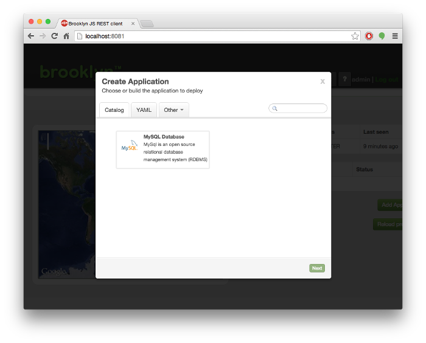

# {{ page.title }}

### Templates and the Add-Application Wizard

A `template` is a full application. It consists of one or more entities inside an application 
(though this is also composable: it can be used as part of another application).
When a `template` is added to the catalog, the blueprint will appear in the 'Create Application' dialog
as shown here:

 

