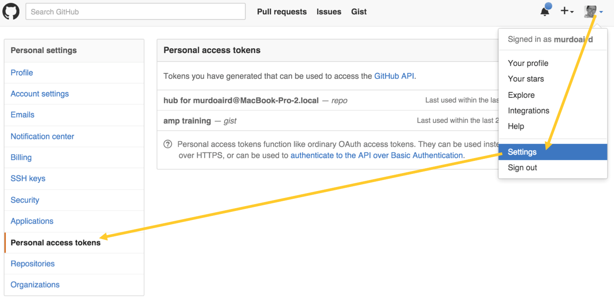

# {{ page.title }}

## Intro

This walkthrough will set up a simple entity, add it to the catalog, and provision it.

For illustration purposes, we will write an integration with [Github Gist](https://gist.github.com/), 
with an effector to create new gists.


## Project Setup

Follow the instructions to create a new Java project using the [archetype](archetype.md), and
import it into your [favorite IDE]({{ book.path.guide }}/dev/env/ide/). This example assumes you 
used the groupId `com.acme` and artifact id `autobrick`.

First ensure you can build this project at the command line, using `mvn clean install`.


## Java Entity Classes

For this particular example, we will use a third party Gist library, so will need to add that as 
a dependency. Add the following to your `pom.xml` inside the `<dependencies>` section 
(see [Maven](https://maven.apache.org/guides/introduction/introduction-to-dependency-mechanism.html) 
for more details):

```xml
<dependency>
  <groupId>org.eclipse.mylyn.github</groupId>
  <artifactId>org.eclipse.egit.github.core</artifactId>
  <version>2.1.5</version>
</dependency>
```

Create a new Java interface, `GistGenerator`, to describe the entity's interface (i.e. the 
configuration options, sensors, and effectors). The code below assumes you have created this
in the package `com.acme` for `src/main/java`.

!CODEFILE "gist_generator/GistGenerator.java"

To describe each part of this:

* The `@ImplementedBy` indicates the implementation class for this entity type - i.e. the class 
  to instantiate when an entity of this type is created.
* By extending `Entity`, we indicate that this interface is an Entity type. We could alternatively
  have extended one of the other sub-types of Entity.
* The `OAUTH_KEY` is a configuration key - it is configuration that can be set on the entity when 
  it is being instantiated.
* The `@Effector` annotation indicates that the given method is an effector, so should be presented
  and tracked as such. Execution of the effector is intercepted, to track it as a task and show its
  execution in the Activity view.
* The `@EffectorParam` annotations give metadata about the effector's parameters. This metadata,
  such as the parameter description, is available to those using the client CLI, rest API and 
  web-console.

Note there is an alternative way of defining effectors - adding them to the entity dynamically, 
discussed in the section [Dynamically Added Effectors](common-usage.md#dynamically-added-effectors).

Next lets add the implementation. Create a new Java class named `GistGeneratorImpl`.

!CODEFILE "gist_generator/GistGeneratorImpl.java"

To describe each part of this:

* Extends `AbstractEntity` - all entity implementations should extend this, or one of its 
  sub-types.
* Implements `GistGenerator`: this is the Entity type definition, so must be implemented.
  Users of the entity will only refer to the interface; they will never be given an instance 
  of the concrete class - instead a [dynamic proxy](https://docs.oracle.com/javase/7/docs/api/java/lang/reflect/Proxy.html) 
  is used (to allow remoting).
* `org.slf4j.Logger` is the logger used throughout Apache Brooklyn.
* Implements the `createGist` effector - we do not need to re-declare all the annotations.
* If no `oath.key` parameter was passed in, then use the configuration set on the entity.
* Use the third party library to create the gist.


### Configuring GitHub

First, create a github.com account, if you do not already have one.

Before running the blueprint, we'll need to generate an access token that has permissions to
create a gist programmatically.

First [create a new access token](https://help.github.com/articles/creating-an-access-token-for-command-line-use/) 
that our blueprint will use to create a gist:

[](gist_generator/gist_create_token.png)

Next, grant the token rights to create gists:

[](gist_generator/gist_grant_access.png)


### Testing

The archetype project comes with example unit tests that demonstrate how to test entities, 
both within Java and also using YAML-based blueprints. 

We will create a similar Java-based test for this blueprint. Create a new Java class named 
`GistGeneratorTest` in the package `com.acme`, inside `src/test/java`.

You will need to substitute the github access token you generated in the previous section for
the placeholder text `xxxxxxxxxxxxxxxxxxxxxxxxxxxxxxxxxxxxxxxx`.

!CODEFILE "gist_generator/GistGeneratorTest.java"

Similarly, we can write a test that uses the `GistGenerator` from a YAML blueprint. 
Create a new Java class named `GistGeneratorYamlTest` in the package `com.acme`, 
inside `src/test/java`.

Again you will need to substitute the github access token you generated in the previous section for
the placeholder text `xxxxxxxxxxxxxxxxxxxxxxxxxxxxxxxxxxxxxxxx`. See the section on 
[externalised configuration](../../ops/externalized-configuration.md) 
for how to store these credentials more securely. 

!CODEFILE "gist_generator/GistGeneratorYamlTest.java"

## Building the OSGi Bundle

Next we will build this example as an [OSGi Bundle](https://www.osgi.org/developer/architecture/) 
so that it can be added to the Apache Brooklyn server at runtime, and so multiple versions of the  
blueprint can be managed.

The `mvn clean install` will automatically do this, creating a jar inside the `target/` sub-directory
of the project. This works by using the 
[Maven Bundle Plugin](http://felix.apache.org/documentation/subprojects/apache-felix-maven-bundle-plugin-bnd.html)
which we get automatically by declaring the `pom.xml`'s parent as `brooklyn-downstream-parent`.


## Adding to the catalog

Similar to the `sample.bom` entity that ships with the archetype, we will define a `.bom` file
to add our `GistGenerator` to the catalog. Substitute the URL below for your own newly built 
artifact (which will be in the `target` sub-directory after running `mvn clean install`).

!CODEFILE "gist_generator/gist_generator.bom"

See [Handling Bundle Dependencies](bundle-dependencies.md)
for a description of the `brooklyn.libraries` used above, and for other alternative approaches.

The command below will use the `br` CLI to add this to the catalog of a running Brooklyn instance.
Substitute the credentials, URL and port for those of your server.

```bash
$ br login https://127.0.0.1:8443 admin pa55w0rd
$ br catalog add gist_generator.bom
```


## Using the blueprint

The YAML blueprint below shows an example usage of this blueprint:

    name: my sample
    services:
    - type: example.GistGenerator
      brooklyn.config:
        oauth.key: xxxxxxxxxxxxxxxxxxxxxxxxxxxxxxxxxxxxxxxx

Note the type name matches the id defined in the `.bom` file.

You can now call the effector by any of the standard means - [web console](../../ops/gui/index.md), 
[REST api](../../ops/rest.md), or [Client CLI](../../ops/cli/index.md).
