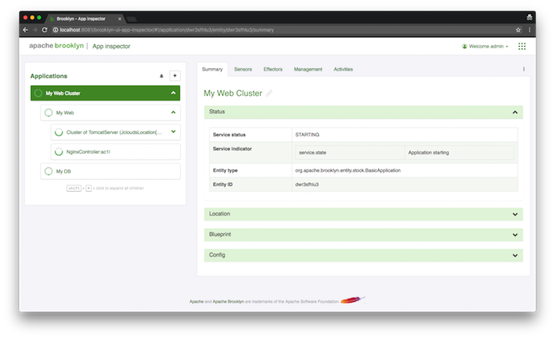
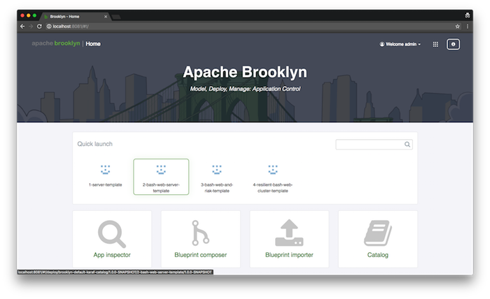



## Launching from a Blueprint

When you first access the web console on [http://127.0.0.1:8081](http://127.0.0.1:8081) you will be greeted by the GUI homepage
comprised of:
- the quick launch panel
- links to UI modules

We'll start by deploying an application via a YAML blueprint consisting of the following layers.

- MySQL DB
- Dynamic web application cluster
  - Nginx load balancer
  - Tomcat app server cluster

Go the "Blueprint Composer" and switch to the YAML editor view (by clicking on the double horizontal arrows icon on the top right corner)
and copy the blueprint below into the editor. 

But *before* you submit it, modify the YAML to specify the location where the application will be deployed.





Replace the `location:` element with values for your chosen target environment, for example to use SoftLayer rather than AWS (updating with your own credentials): 


location:
  jclouds:softlayer:
    identity: ABCDEFGHIJKLMNOPQRST
    credential: s3cr3tsq1rr3ls3cr3tsq1rr3ls3cr3tsq1rr3l


With the modified YAML, click on the "Deploy" button. Brooklyn will begin deploying your application and redirect you to the
"Application Inspector". In this screen, you will see your application as "Starting".

Depending on your choice of location it may take some time for the application nodes to start, the next page describes how you can monitor the progress of the application deployment and verify its successful deployment.

## Launching from the Catalog

Instead of pasting the YAML blueprint each time, it can be added to the Brooklyn Catalog where it will be accessible from the "Quick Launch" panel or "Catalog" and "Blueprint Composer" UI modules.

<!-- TODO: more detail for adding to catalog? but wait for persistence to be the default, 
     rather than extensively document default.catalog.bom.
     also need to include instructions on stopping (currently in help, including stopping apps) -->

## Next 

So far we have touched on Brooklyn's ability to *deploy* an application blueprint to a cloud provider.  
The next section will show how to **[Monitor and Manage Applications](managing)**.
